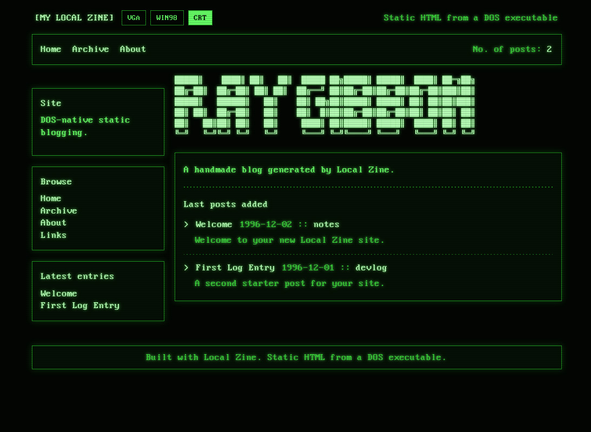
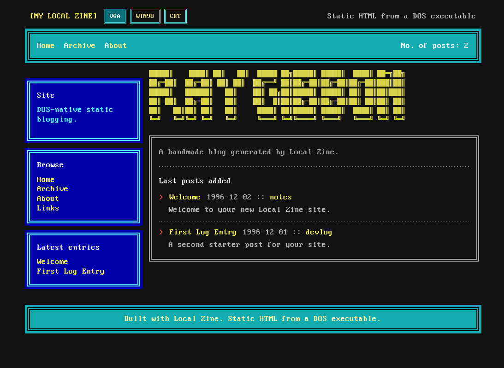
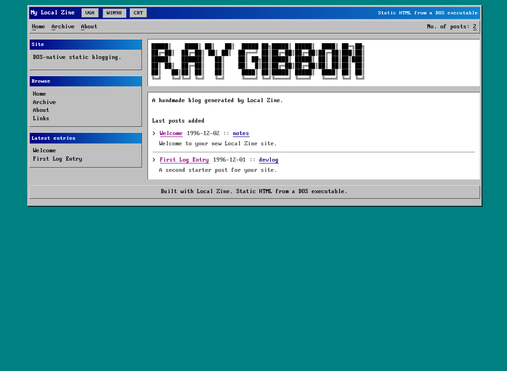

# Zine

**Zine** is a tiny 16-bit static site generator for MS-DOS 6.22.
It builds real DOS binaries with OpenWatcom and generates plain HTML from simple text source files.
It is designed to run under DOSBox-X or on vintage DOS hardware.

*This repository is licensed under BSD 2-clause. See `LICENSE`.*

---

## Why this exists

- Tiny static site generator written in C
- Generates DOS-safe output for `OUT/`, `PST/`, `PAG/`, `IMG/`, and `FNT/`
- Keeps the generator separate from the preview server
- Uses minimal dependencies and a tiny line-based markup format
- Targets real-mode DOS with careful filename, memory, and build constraints

---

## What it does

- builds a DOS executable: `mnt/zine.exe`
- reads post metadata from `posts.lst` / `posts/*.txt`
- reads page metadata from `pages.lst` / `pages/*.txt`
- copies images from `IMG/` into `OUT/IMG/`
- writes generated HTML, CSS, and font files into `OUT/`
- keeps outputs DOS-safe and uppercase, e.g. `INDEX.HTM`
- supports drafts, categories, tags, and archives
- uses incremental rebuilds to avoid unnecessary output churn

---

## Screenshots







---

## Quick commands

```text
zine.exe
zine.exe -V
zine.exe --version
zine.exe -v
zine.exe build MYBLOG
zine.exe build MYBLOG -v
zine.exe init MYBLOG
zine.exe new SLUG
zine.exe newpage SLUG
zine.exe clean
zine.exe serve
zine.exe serve 8080
zine.exe serve MYBLOG
zine.exe serve MYBLOG 8080
zine.exe serve C:\MYBLOG\OUT 8080
```

### Command summary

- `zine.exe` — build the current site into `OUT/`
- `zine.exe -V` / `zine.exe --version` — print the version
- `zine.exe -v` — verbose build
- `zine.exe build MYBLOG` — build a site from another folder
- `zine.exe init MYBLOG` — scaffold a new site
- `zine.exe new SLUG` — add a new post
- `zine.exe newpage SLUG` — add a standalone page
- `zine.exe clean` — remove generated output
- `zine.exe serve ...` — build and launch the preview server

---

## Getting started

1. Open a shell in the repository root.
2. Run `scripts/build-zine.sh` to build `mnt/zine.exe`.
3. Run `scripts/build-zhttp.sh` to build `mnt/zhttp.exe`.
4. Start a site with `./mnt/zine.exe init MYBLOG`.
5. Use `./mnt/zine.exe build MYBLOG` or `./mnt/zine.exe serve MYBLOG 8080`.

> If you are using VS Code tasks, run `Build Zine`, `Build ZHTTP`, and then `Serve MYBLOG`.

---

## Preview server

The preview server is handled by `zhttp.exe`, not `zine.exe`.
That keeps Watt-32 and DOS networking isolated from the generator.

### Recommended DOSBox-X setup

```text
MOUNT C /path/to/local-zine/mnt
C:
SET WATTCP.CFG=C:\
NE2000 0x60 3 0x300
ZINE.EXE SERVE MYBLOG 8080
```

If you use DOSBox-X `slirp`, forward the host port:

```ini
[ethernet, slirp]
tcp_port_forwards = 8080
```

Then open:

```text
http://localhost:8080
```

### Important notes

- Keep `zhttp.exe` next to `zine.exe` in `mnt/`
- `zine.exe serve` will build the site before starting the preview server
- `zine.exe serve MYBLOG` builds and serves `MYBLOG/OUT`
- `zine.exe serve C:\MYBLOG\OUT 8080` serves that output directory directly

---

## Build notes

The host build scripts are:

- `scripts/build-zine.sh`
- `scripts/build-zhttp.sh`
- `scripts/configure-watt32-watcom.sh`

The repo now defaults to the local Watt-32 tree at:

- `3rd/watt32/src`

The preview server links Watt-32 from:

- `3rd/watt32/src/lib/wattcpwl.lib`

Override `WATT_ROOT` if you want to use a different Watt-32 installation.

### License

This repository is licensed under the BSD 2-clause license. See `LICENSE`.

### Third-party licenses

- Watt-32 is included from `3rd/watt32` under its existing license terms.
- See `3rd/watt32/src/inc/copying.bsd` for the BSD license text included in the Watt-32 tree.
- OpenWatcom itself is not included in this repo and is used as a host tool under its own license.

### VS Code tasks

The workspace tasks use the repo-local `3rd/watt32/src` path for Watt-32 where possible.

---

## Repo layout

```text
src/
  zine/
  shared/
  zhttp/
scripts/
build/
mnt/
3rd/watt32/
```

### Source layout

```text
src/
  zine/
    main.c
    content.c
    preview.c
    scaffold.c
    site.c
    theme.c
    util.c
  shared/
    zpath.c
    zfile.c
    zlog.c
  zhttp/
    main.c
    http_parse.c
    http_reply.c
    serve_file.c
    mime.c
    net_watt32.c
```

---

## Site layout

After `zine.exe init MYBLOG`:

```text
MYBLOG/
├── site.txt
├── posts.lst
├── pages.lst
├── assets.lst
├── posts/
│   ├── welcome.txt
│   └── firstlog.txt
├── pages/
│   └── links.txt
├── IMG/
└── OUT/
    ├── INDEX.HTM
    ├── PST/
    ├── PAG/
    ├── IMG/
    └── FNT/
```

Source files stay in the site root; generated files go into `OUT/`.

---

## Themes and banners

- `VGA.SRC` — classic VGA theme
- `WIN98.SRC` — Windows 95/98 style theme
- `CRT.SRC` — green-screen CRT theme
- `BANNER.TXT` — editable banner art

`src/zine/templates/` contains checked-in seed copies.
`scripts/build-zine.sh` copies those seed files into `mnt/`.
`src/zine/scaffold.c` only contains fallback strings used during `init`.

> Edit `VGA.SRC`, `WIN98.SRC`, `CRT.SRC`, and `BANNER.TXT` for site styling.

Themes should reference fonts through `FNT/`:

- `FNT/VGA.TTF`
- `FNT/W98.TTF`
- `FNT/CRT.TTF`

---

## Content model

### Posts

Posts live in `posts/*.txt` and are listed in `posts.lst`.

Example post header:

```text
title: Welcome
slug: welcome
date: 1996-12-02
category: notes
summary: Welcome to your new Local Zine site.
tags: dos, starter
draft: no
```

### Pages

Pages live in `pages/*.txt` and are listed in `pages.lst`.

Example page header:

```text
title: Links
slug: links
summary: Extra links and notes.
tags: pages, links
draft: no
```

### Images

Images are copied from `IMG/` to `OUT/IMG/`.
Use uppercase DOS 8.3 filenames, for example:

```text
260411A1.PNG
260411A2.JPG
```

`assets.lst` is optional and only needed for images that are not referenced directly from content.

---

## Markup

Local Zine uses a simple, small parser instead of full Markdown.

Supported syntax:

- `# Heading`
- `## Subheading`
- `- list item`
- `=> URL text`
- `> quote`
- `*emphasis*`
- `[label](https://example.com)`
- ``
- `` ``` `` fenced code blocks
- blank lines separate paragraphs

---

## DOS-safe rules

- slugs must be DOS-safe and 8 characters or fewer
- filenames in `posts.lst` and `pages.lst` must be DOS-safe
- slug must match the source filename
- published slugs must be unique
- output directories are short: `OUT`, `PST`, `PAG`, `IMG`, `FNT`
- generated files are uppercase 8.3 names
- category and tag archives use stable DOS-safe filenames

Drafts are parsed and validated, but not published.

---

## Incremental build behavior

Local Zine stores a small manifest in `OUT/BUILD.DAT` and uses file timestamps plus cached metadata hashes.

Skipped when unchanged:

- post pages
- standalone pages
- theme/font copies
- asset copies

Forced full rebuild on:

- changes to `site.txt`
- metadata changes
- `posts.lst` or `pages.lst` changes
- missing shared outputs like `INDEX.HTM`

The status line reports rewritten outputs; a true no-op rebuild should say `0 changes`.

---

## Features

- starter site scaffolding
- post creation
- page creation
- build by folder
- cleanup command
- draft support
- categories, tags, archives
- DOS-safe HTML output
- separate Watt-32 preview server
